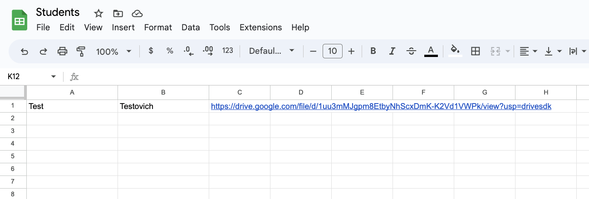
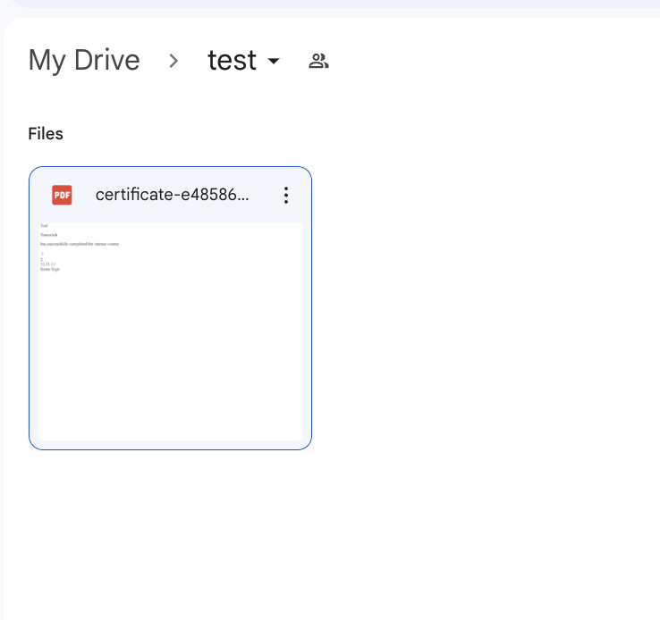

## Certificate Generator

### Link to Wiki [How to create a project in GCP and use it](https://github.com/baylakmongush/certificate_generation/wiki)


This is a simple script that generates certificates of `Completion Courses` based on a given template for each student in a `Google Sheets` spreadsheet. The generated certificates are then uploaded to `Google Drive` and their links are added to the spreadsheet.

### Installation
1. Clone the repository to your local machine.
2. Install the required Python packages using `pip install -r requirements.txt`.
3. Set up the necessary authentication files:
   * Create a `env` directory in the project root.
   * Download the service account JSON file and save it as `service_account.json` in the `env` directory.
   * Download the `client_secrets.json` file for Google Drive API authentication and save it in the project(current) directory.
4. Set up the `Google Sheets` document:
   * Create a new `Google Sheets` document.
   * Add a sheet to the document.
   * In the first row of the sheet, add the following column headers: `Name`, `Surname`, `Certificate Link`.

   []()
5. Create a Google Drive folder:
   * Go to https://drive.google.com/drive/my-drive and log in to your Google account if you are not already logged in.
   * Click the New button in the top left corner of the page and select Folder.
   * Name the folder and click Create.
6. Grant the service account the necessary permissions:
   * In the `Google Sheets` document, click on the `Share` button in the top right corner.
   * Add the `email` address of the service account from the `service_account.json` file and grant it `Editor` permissions.
   * In the `Google Drive` folder, right-click on the folder and select Share.
   * Add the `email` address of the service account from the `service_account.json` file and grant it `Writer` permissions.
7. Customize the certificate template:
   * Create a new HTML file in the `templates` directory.
   * Use Jinja2 templating syntax to customize the certificate template.
### Usage
#### To run the script, execute the following command:
>bash
```
python certificate_generator.py -t <path_to_template_file> -d <date> -f <folder_id>
```
Where `<path_to_template_file>` is the path to the HTML file containing the certificate template, and `<referer>` is the name of the person or organization issuing the certificates.
`<id>` - date of finishing course
`<folder_id>` id number of folder in `Google Drive` ``https://drive.google.com/drive/folders/<folder_id>``

The script will generate a certificate for each student in the `Google Sheets` document, upload the certificate to `Google Drive`, and add the link to the `Certificate Link` column of the corresponding row in the spreadsheet. The Referer column will also be updated with the name of the person or organization issuing the certificates.




### License
This project is licensed under the terms of the MIT license.
